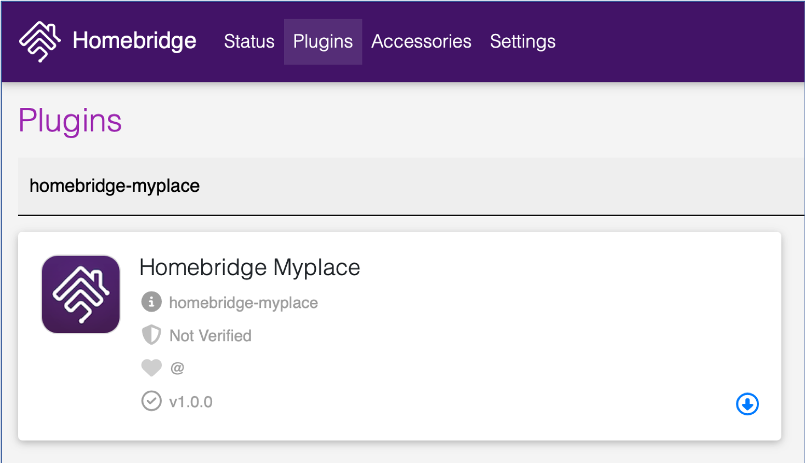
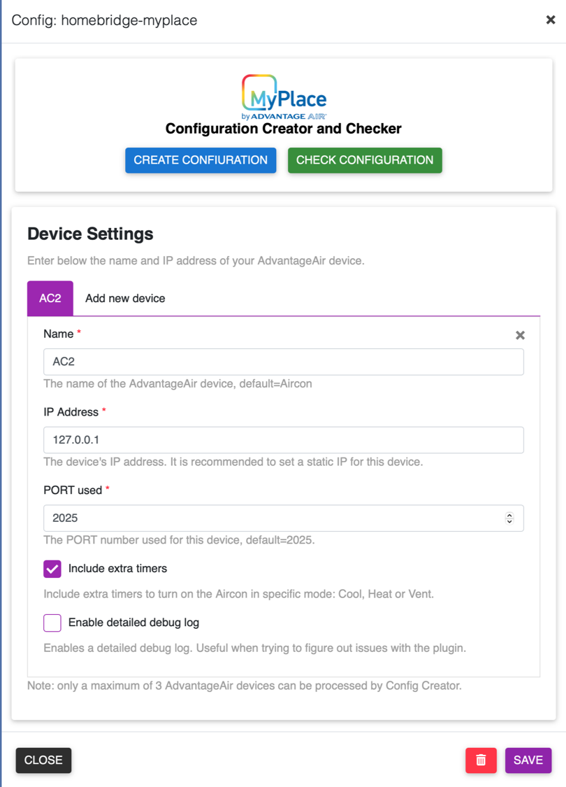

<p align="center">


</p>

# homebridge-myplace
An independent plugin bringing [Advanatge Air](https://www.advantageair.com.au/) MyPlace System and its smaller siblings (E-zone, MyAir, MyAir4, etc) to Homekit.

This plugin is a result of blending together, with modifications to make it more efficient, the [homebridge-cmd4-AdvantageAir](https://github.com/mitch7391/homebridge-cmd4-AdvantageAir) plugin v3.11.0 and the [homebridge-cmd4](https://github.com/ztalbot2000/homebridge-cmd4) plugin v7.0.2. 

## Supported Advantage Air Control Units:
  * [MyPlace](https://apps.apple.com/au/app/myplace/id996398299)
  * [MyAir4](https://apps.apple.com/au/app/myair4/id925994861)
  * [MyAir](https://apps.apple.com/au/app/myair/id481563583)
  * [E-zone](https://apps.apple.com/au/app/e-zone/id925994857)
  * [Fujitsu anywAIR](https://apps.apple.com/au/app/anywair/id1509639853)

## Installation:
### Raspbian/HOOBS/macOS/NAS:
1. Install Homebridge via these instructions for [Raspbian](https://github.com/homebridge/homebridge/wiki/Install-Homebridge-on-Raspbian), [HOOBS](https://support.hoobs.org/docs) or [macOS](https://github.com/homebridge/homebridge/wiki/Install-Homebridge-on-macOS), if you have not already.

2. Find the `homebridge-myplace` plugin via the Homebridge UI 'Plugins' tab search function, once found, click the blue down arrow at the bottom right to install.
  
   *Please note that this plugin is using the same engine as in `homebridge-cmd4` plugin. As such, if you have `homebridge-cmd4` installed, you have to uninstall it before installing this plugin, otherwise there will be some conflicts and one of them will not run. If you do use `homebridge-cmd4` for some other purposes, you can include the same config in `homebridge-myplace` and it will still run as if it is in `homebridge-cmd4`.*

     <p align="left">
     
     </p>
3. Check if <B>jq</B> and <B>curl</B> are installed (<B>curl</B> should already be):
```shell
jq -V
curl -V
```
If they are installed, the above command should return a version number.

4. If not already, install <B>jq</B> and <B>curl</B> via your Homebridge UI terminal or through ssh: 
```shell
# Raspbian/Hoobs:
sudo apt-get install <jq or curl>

# macOS:
brew install <jq or curl>

# Synology NAS:
apt-get install <jq or curl>

# QNAP NAS:
apk add <jq or curl>
```


5. Create your Homebridge `config.json`
   
  Go to the 'Plugins' tab in Homebridge UI, locate your newly installed `Homebridge Myplace` plugin and click the three dots on the bottom right, select `Plugin Config` and it should launch the <B>Configuration Creator and Checker</B> and <B>Device Settings</B> page.
     <p align="left">
     
     </p>

   In <B>Device Settings</B> area, fill out the `Name`, `IP Address` and `PORT used` fields (default PORT is `2025` for most users, Fujitsu anywAIR users set this to `10211` ) and check/uncheck the checkboxes for `Include extra timers` and `Enable detailed debug log`, then click `SAVE`. This is to save your system parameters. Click `CLOSE` if a pop up urging you to `RESTART HOMEBRIDGE`.
   
   Go back to `Plugin Config` again and press the `CREATE CONFIGURATION` button to create the required configuration file.  On a sucess, click `CHECK CONFIGURATION`to check the configuration file just created is in order. On a success it will say `Passed`; if something is incorrect, an error message will pop up telling you what needs to be fixed. Click `CLOSE` then restart Homebridge.

* HOOBS users who do not have access to Homebridge UI (for now!) will have to run the Config Creator on a terminal:
```shell
   cd
   <Plugin Path>/node_modules/homebridge-myplace/ConfigCreator.sh
```
  then follow the on-screen instructions.
  
  *typical `<Plugin Path>` is `/var/lib/hoobs/<bridge>` 

## How You Can Help:
* Report Bugs/Errors by opening Issues/Tickets.
* Suggest Improvements and Features you would like to see!


## Special Thanks
1. Many thanks to [Mitch Williams](https://github.com/mitch7391) who has created the wonderful [homebridge-cmd4-AdvantageAir](https://github.com/mitch7391/homebridge-cmd4-AdvantageAir) plugin and has allowed me to participate in its development and in the process I have leant a lot on **bash** and **javascript** coding in homebridge environment.
2. Many thanks also to [John Talbot](https://github.com/ztalbot2000) for his fantastic [homebridge-cmd4](https://github.com/mitch7391/homebridge-cmd4) plugin which I have forked and used it as the main engine for this plugin.
3. And never forget to thank my beautiful wife who has put up with my obsession on this.....


## LICENSE:
This plugin is distributed under the MIT license. See [LICENSE](https://github.com/mitch7391/cmd4-E-Zone-MyAir/blob/master/LICENSE) for details.
