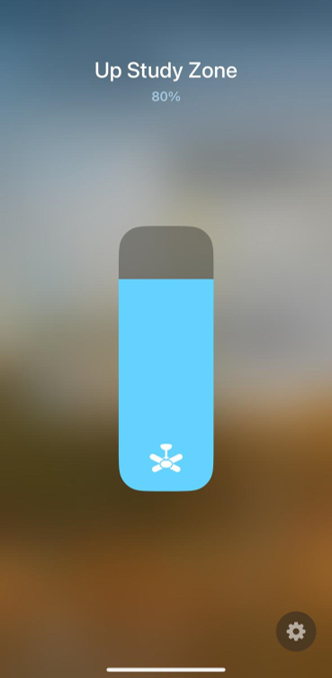
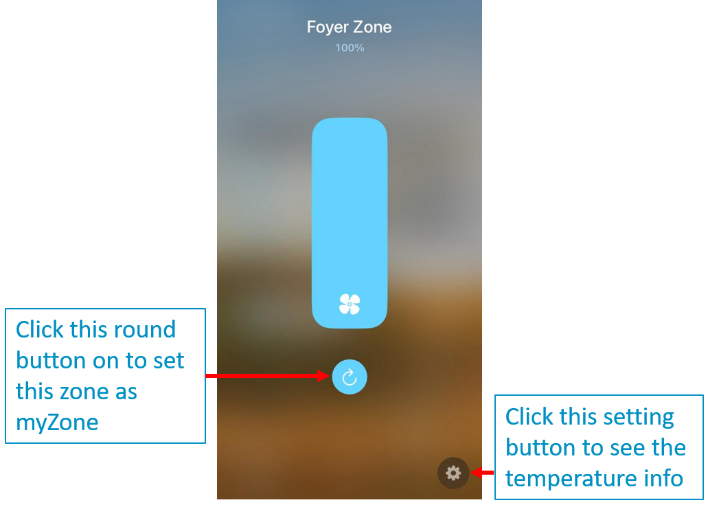

<span align="center">

<p align="center">

</p>

# homebridge-myplace

[](https://github.com/homebridge/homebridge/wiki/Verified-Plugins)
[](https://www.npmjs.com/package/homebridge-myplace)
[](https://www.npmjs.com/package/homebridge-myplace)
[](https://github.com/uswong/homebridge-myplace/blob/master/LICENSE)
[](https://discord.gg/uaEXgtt72q)


</span>

An independent plugin bringing [Advantage Air](https://www.advantageair.com.au/) MyPlace System, its smaller siblings (E-zone, MyAir, MyAir4, etc) and its cousins (e.g. Fujitsu AnywAir) to Homekit.

## Supported Advantage Air Control Units
  * [MyPlace](https://apps.apple.com/au/app/myplace/id996398299)
  * [MyAir4](https://apps.apple.com/au/app/myair4/id925994861)
  * [MyAir](https://apps.apple.com/au/app/myair/id481563583)
  * [E-zone](https://apps.apple.com/au/app/e-zone/id925994857)
  * [Fujitsu anywAIR](https://apps.apple.com/au/app/anywair/id1509639853)

## Installation
### Raspbian/HOOBS/macOS/NAS
1. Install Homebridge via these instructions for [Raspbian](https://github.com/homebridge/homebridge/wiki/Install-Homebridge-on-Raspbian), [HOOBS](https://support.hoobs.org/docs) or [macOS](https://github.com/homebridge/homebridge/wiki/Install-Homebridge-on-macOS), if you have not already.

2. Find the `homebridge-myplace` plugin via the Homebridge UI 'Plugins' tab search function, once found, click the blue down arrow at the bottom right to install.
  
     <p align="left">
     
     </p>
3. Check if <B>jq</B> and <B>curl</B> are installed (<B>curl</B> should already be):
```shell
jq -V
curl -V
```
If they are installed, the above command should return a version number.

4. If not already, install <B>jq</B> and <B>curl</B> via your Homebridge UI terminal or through ssh: 
```shell
# Raspbian/Hoobs:
sudo apt-get install <jq or curl>

# macOS:
brew install <jq or curl>

# Synology NAS:
apt-get install <jq or curl>

# QNAP NAS:
apk add <jq or curl>
```


5. Create your Homebridge `config.json`
   
  Go to the 'Plugins' tab in Homebridge UI, locate your newly installed `Homebridge Myplace` plugin and click the three dots on the bottom right, select `Plugin Config` and it should launch the <B>Configuration Creator and Checker</B> and <B>Device Settings</B> page.
     <p align="left">
     
     </p>

   In <B>Device Settings</B> area, fill out the `Name`, `IP Address` and `PORT used` fields (default PORT is `2025` for most users, Fujitsu anywAIR users set this to `10211` ) and check/uncheck the checkboxes for `Include extra timers` and `Enable detailed debug log`, then click `SAVE`. This is to save your system parameters. Click `CLOSE` if a pop up urging you to `RESTART HOMEBRIDGE`.

*Please use only alphanumeric, space, and apostrophe characters for `Name`.*
     
   Go back to `Plugin Config` again and press the `CREATE CONFIGURATION` button to create the required configuration file.  On a sucess, click `CHECK CONFIGURATION`to check the configuration file just created is in order. On a success it will say `Passed`; if something is incorrect, an error message will pop up telling you what needs to be fixed. Click `CLOSE` (do not click `SAVE`) then restart Homebridge.

* HOOBS users who do not have access to Homebridge UI (for now!) will have to run the Config Creator on a terminal:
```shell
   cd
   <Plugin Path>/node_modules/homebridge-myplace/ConfigCreator.sh
```
  then follow the on-screen instructions.
  
  *typical `<Plugin Path>` is `/var/lib/hoobs/<bridge>` 

## How it Looks and Works
### (A) Aircon System (MyAir, E-zone, etc) has the following typical Homekit tiles:
<p align="left">

</p>

#### (i) Thermostat, Fan Switch and Fan Speed Control
<p align="left">

 
</p>

<B>Thermostat</B> is where the desired target temperature can be set.  

<B>Thermostat</B> has 4 modes- <B>Off</B>, <B>Cool</B>, <B>Heat</B> and <B>Auto</B>. It does not have <B>dry</B> and <B>fan</B> modes.  As such, the <B>Thermostat Auto</B> mode is repurposed as <B>dry</B> mode in this plugin and a separate <B>Fan</B> switch is used for <B>fan</B> mode.

Both the <B>Thermostat</B> and <B>Fan</B> switch has associated fan speed control and either one can be used to set the fan speed. It is duplicated only for convenience. The fan speed control has 4 tiers - <B>low</B>, <B>mid</B>, <B>high</B> and <B>auto</B> or <B>ezfan</B> and the %-rotationSpeed is snapped to 25% for <B>low</B>, 50% for <B>mid</B>, 90% for <B>high</B> and 100% for <B>auto</B> or <B>ezfan</B>.

#### (ii) Timer
<p align="left">

</p>

A timer is repurposed from <B>Lightbulb</B> accessory and its <B>%-brightness</B> as proxy for duration configured to represent 6 minutes per 1%. 10%-timer is then a 60-minutes or 1-hour timer and 25%-timer is a 2.5-hours timer. A maximum of 10-hour timer (100%-timer) can be set. This timer will turn ON or OFF the Aircon system.

If <B>Include extra timers</B> is checked during the setup process, 3 more timers would have been created- a <B>Fan Timer</B>, a <B>Cool Timer</B> and a <B>Heat Timer</B>:
<p align="left">

</p>

These timers will turn ON the Aircon system in specific mode as their names suggest. *Please note that the icons on the Timer tiles in the example above have been deliberately changed to distinguish them from lights. All timers are repurposed from <B>Lightbulb</B> accessory.*

#### (iii) Zone Control
<p align="left">

 
</p>

Zone control is repurposed from <B>Fan</B> accessory with its <B>%-rotationSpeed</B> as proxy for zone %-open.  

For zones with temperature sensors and with myZone defined, a <B>myZone</B> switch, repurposed from <B>rotationDirection</B> will appear as a round button. Turn this button <B>ON</B> to set this zone as myZone.  *Please note that as per Advantage Air system design, myZone cannot be turned <B>OFF</B>. It can only be turned <B>OFF</B> by setting another zone as myZone.  Moreover, %-open for these zones cannot be set.  It is set automatically by the system.*

For zone current temperature info, click the setting button.

### (B) Lights
<p align="left">

</p>

<p align="left">


</p>

Light with dimmer has a slider to control its brightness while a light without dimmer just has a simple ON/OFF light switch.

### (C) Fans

<p align="left">

</p>

<p align="left">

</p>

From version 1.1.6 onwards, if a light switch has a name ending with " Fan", it is regarded as a switch for turning ON or OFF a fan.  The icon on Homekit will then be a fan instead of a lightbulb. 

### (D) Garage Door and Blinds
<p align="left">

</p>

<p align="left">


</p>

Garage Door is either Opened or Closed, hence it appears as a simple switch while Blinds can be partially open, as such, it has a slider to set the %-open.

## How You Can Help
* Report Bugs/Errors by opening Issues/Tickets.
* Suggest Improvements and Features you would like to see!


## Special Thanks
1. Many thanks to [Mitch Williams](https://github.com/mitch7391) who has created the wonderful [homebridge-cmd4-AdvantageAir](https://github.com/mitch7391/homebridge-cmd4-AdvantageAir) plugin and has allowed me to participate in its development and in the process I have leant a lot about GitHub and on **bash** and **javascript** coding in homebridge environment.
2. Many thanks also to [John Talbot](https://github.com/ztalbot2000) for his fantastic [homebridge-cmd4](https://github.com/ztalbot2000/homebridge-cmd4) plugin which I have forked and used it as the main engine for this plugin.
3. And never forget to thank my beautiful wife who has put up with my obsession on this.....


## LICENSE
This plugin is distributed under the MIT license. See [LICENSE](https://github.com/uswong/homebridge-myplace/blob/main/LICENSE) for details.
