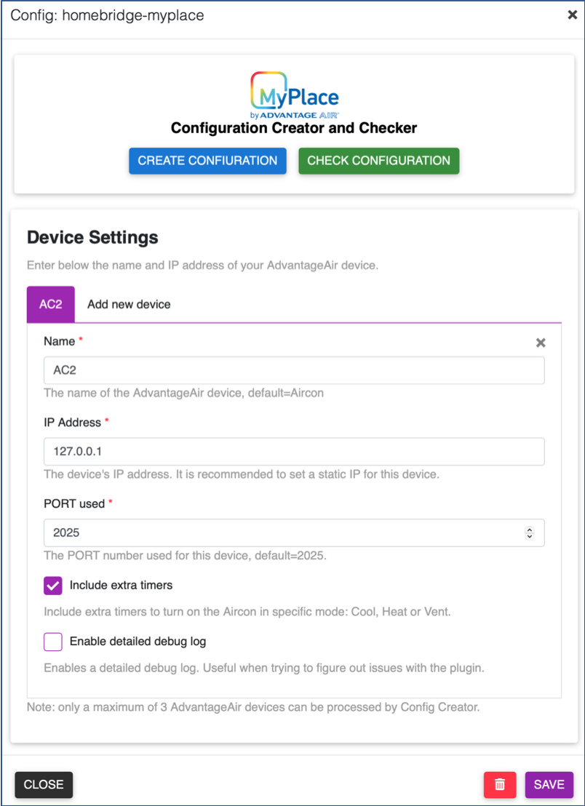

<span align="center">

<p align="center">

</p>

# homebridge-myplace

[](https://github.com/homebridge/homebridge/wiki/Verified-Plugins)
[](https://www.npmjs.com/package/homebridge-myplace)
[](https://www.npmjs.com/package/homebridge-myplace)
[](https://github.com/uswong/homebridge-myplace/blob/master/LICENSE)
[](https://discord.gg/uaEXgtt72q)


</span>

An independent plugin bringing [Advantage Air](https://www.advantageair.com.au/) MyPlace System, its smaller siblings (E-zone, MyAir, MyAir4, etc) and its cousins (e.g. Fujitsu AnywAir) to Homekit.

## Supported Advantage Air Control Units
  * [MyPlace](https://apps.apple.com/au/app/myplace/id996398299)
  * [MyAir4](https://apps.apple.com/au/app/myair4/id925994861)
  * [MyAir](https://apps.apple.com/au/app/myair/id481563583)
  * [E-zone](https://apps.apple.com/au/app/e-zone/id925994857)
  * [Fujitsu anywAIR](https://apps.apple.com/au/app/anywair/id1509639853)

## Installation
### Raspbian/HOOBS/macOS/NAS
1. Install Homebridge via these instructions for [Raspbian](https://github.com/homebridge/homebridge/wiki/Install-Homebridge-on-Raspbian), [HOOBS](https://support.hoobs.org/docs) or [macOS](https://github.com/homebridge/homebridge/wiki/Install-Homebridge-on-macOS), if you have not already.

2. Find the `homebridge-myplace` plugin via the Homebridge UI 'Plugins' tab search function, once found, click the blue *down-arrow* at the bottom right to install.  Once install, click on the three dots at the bottom right and select `JSON Config`, a pop-up box showing a small config in it. Do not edit anything but click `SAVE`.  More pop-up boxes may appear, click `SAVE` to all until you are prompted to `RESTART HOMEBRIDGE`.  You do not need to restart homebridge but can click `CLOSE` now to move on to the next step.
  
     <p align="left">
     
     </p>
3. Check if <B>jq</B> and <B>curl</B> are installed (<B>curl</B> should already be):
   ```shell
   jq --version
   curl --version
   ```
   If they are installed, the above command should return a version number. If not, install them:
   ##### For Raspbian/Hoobs:
   ```shell
   sudo apt-get install <jq or curl>
   ```
   ##### For MacOS:
   ```shell
   brew install <jq or curl>
   ```
   ##### For Synology NAS:
   ```shell
   apt-get install <jq or curl>
   ```
   ##### For QNAP NAS:
   ```shell
   apk add <jq or curl>
   ```
   #### Important note:
   At the time of updating this README, the `apt-get insatall` only allow jq-1.6 to be installed, which is notorously slow! To install the lastest and **MUCH faster** version of jq-1.7.1, please follow the step-by-step guide below:
   1. Download the Source Code:
   
      You can download the source code "jq-1.7.1.tar.gz" for jq 1.7.1 from the official GitHub releases page (https://github.com/jqlang/jq/releases) or use the link below:
      ```shell
      wget https://github.com/jqlang/jq/releases/download/jq-1.7.1/jq-1.7.1.tar.gz
      ```
   2. Install Dependencies:
   
      Ensure you have the necessary build tools and dependencies installed. You can do this by running:
      ```shell
      sudo apt-get update
      sudo apt-get install -y autoconf automake libtool make gcc
      ```
   3. Extract and Build:
   
      Extract the downloaded tarball and navigate to the directory:
      ```shell
      tar -xvzf jq-1.7.1.tar.gz
      cd jq-1.7.1
      chmod +x configure
      ```
   4. Run the following commands to build and install jq:
      ```shell
      ./configure
      make
      sudo make install
      ```
   5. Verify Installation:

      After installation, you can verify that jq is installed correctly by running:
      ```shell
      jq --version
      ```

4. Create MyPlace configuration file:
   
   Go to the 'Plugins' tab in Homebridge UI, locate your newly installed `Homebridge Myplace` plugin and click the three dots on the bottom right, select `Plugin Config` and it should launch the <B>Configuration Creator and Checker</B> and <B>Device 
   Settings</B> page.
        <p align="left">
        
        </p>

   In <B>Device Settings</B> area, fill out the `Name`, `IP Address` and `PORT used` fields (default PORT is `2025` for most users, Fujitsu anywAIR users set this to `10211` ) and check/uncheck the self-explanatory checkboxes for `Include extra timers` and `Enable detailed debug log`, then click `SAVE`. This is to save your system parameters. Click `CLOSE` if a pop up urging you to `RESTART`.
     
   Go back to `Plugin Config` again and press the `CREATE CONFIGURATION` button to create the required configuration file.

   On a sucess, you may click `CHECK CONFIGURATION`to check the configuration file just created is in order. On a success it will say `Passed`; if something is incorrect, an error message will pop up telling you what needs to be fixed.

   Otherwise, click `SAVE` then `RESTART`.

   **HOOBS** users who do not have access to Homebridge UI (for now!) will have to run the Config Creator on a terminal:
   ```shell
      cd
      <Plugin Path>/node_modules/homebridge-myplace/ConfigCreator.sh
   ```
     then follow the on-screen instructions.
  
     *typical `<Plugin Path>` is `/var/lib/hoobs/<bridge>` 

## How it Looks and Works
### (A) Aircon System (MyAir, E-zone, etc) has the following typical Homekit tiles:
<p align="left">

</p>

#### (i) Thermostat, Fan Switch and Fan Speed Control
<p align="left">

 
</p>

<B>Thermostat</B> is where the desired target temperature can be set.  

<B>Thermostat</B> has 4 modes- <B>Off</B>, <B>Cool</B>, <B>Heat</B> and <B>Auto</B>. It does not have <B>dry</B> and <B>fan</B> modes.  As such, the <B>Thermostat Auto</B> mode is repurposed as <B>dry</B> mode in this plugin and a separate <B>Fan</B> switch is used for <B>fan</B> mode.

Both the <B>Thermostat</B> and <B>Fan</B> switch has associated fan speed control and either one can be used to set the fan speed. It is duplicated only for convenience. The fan speed control has 4 tiers - <B>low</B>, <B>mid</B>, <B>high</B> and <B>auto</B> or <B>ezfan</B> and the %-rotationSpeed is snapped to 25% for <B>low</B>, 50% for <B>mid</B>, 90% for <B>high</B> and 100% for <B>auto</B> or <B>ezfan</B>.

#### (ii) Timer
<p align="left">

</p>

A timer is repurposed from <B>Lightbulb</B> accessory and its <B>%-brightness</B> as proxy for timer duration, configured to represent 6 minutes per 1%. So a 10%-timer is a 60-minutes or 1-hour timer and 25%-timer is a 2.5-hours timer. A maximum of 10-hour timer (100%-timer) can be set. This timer will turn ON or OFF the Aircon system.

If <B>Include extra timers</B> was selected during the setup process, 3 more timers would have been created- a <B>Fan Timer</B>, a <B>Cool Timer</B> and a <B>Heat Timer</B>:
<p align="left">

</p>

These timers will turn ON the Aircon system in specific mode as their names suggest. 

*Please note that the icons on the Timer tiles in the example above have been deliberately changed to distinguish them from lights.*

#### (iii) Zone Control
<p align="left">

</p>

Zone control is repurposed from <B>Fan</B> accessory with its <B>%-rotationSpeed</B> as proxy for Zone damper %-open and <B>rotationDirection</B> as <B>myZone</B> button.  <B>Thermostat</B> accessory is used for setting the Zone target temperature.

<B>(a) A non temperature controlled Zone:</B> Only a slider for zones without any temperature sensors.  The damper %-open is to be adjusted manually.

<B>(b) A temperature controlled Zone but without myZone defined:</B> The damper %-open is adjusted automatically by the system, it cannot be adjusted manually. The slider is to show what the system has set the damper %-open for this zone for your INFO only. To turn off the Zone, slide the slider to zero. To turn it on, tap anywhere within the slider. 

Use the <B>Thermostat</B> to set the target temperature by moving the big white dot. The small white dot is an indication of the measured temperature of the Zone. The mode of the <B>Thermostat</B> (`Cool`, `Heat` or `Auto`) reflects the current mode of the Aircon system for your INFO only, you cannot use it to change the mode of the Aircon here. When the Aircon mode is on `dry` or `fan`, it will be shown as `Auto`.

<B>(c) A temperature controlled Zone with myZone defined:</B> Same as <B>(b)</B> but with an additional round button for setting this zone as <B>myZone</B>. Please note that <B>myZone</B> cannot be turned `OFF` as per AdvantageAir system design. It can only be turned `OFF` by setting another zone as <B>myZone</B>.

### (B) Lights
<p align="left">

</p>

<p align="left">


</p>

Light with dimmer has a slider to control its brightness while a light without dimmer just has a simple ON/OFF light switch.

### (C) Fans

<p align="left">

</p>

<p align="left">

</p>

From version 1.1.6 onwards, if a light switch has a name ending with " Fan", it is regarded as a switch for turning ON or OFF a fan.  The icon on Homekit will then be a fan instead of a lightbulb. 

### (D) Garage Door and Blinds
<p align="left">

</p>

<p align="left">


</p>

Garage Door is either Opened or Closed, hence it appears as a simple switch while Blinds can be partially open, as such, it has a slider to set the %-open.

## How You Can Help
* Report Bugs/Errors by opening Issues/Tickets.
* Suggest Improvements and Features you would like to see!


## Special Thanks
1. Many thanks to [Mitch Williams](https://github.com/mitch7391) who has created the wonderful [homebridge-cmd4-AdvantageAir](https://github.com/mitch7391/homebridge-cmd4-AdvantageAir) plugin and has allowed me to participate in its development and in the process I have leant a lot about GitHub and on **bash** and **javascript** coding in homebridge environment.
2. Many thanks also to [John Talbot](https://github.com/ztalbot2000) for his fantastic [homebridge-cmd4](https://github.com/ztalbot2000/homebridge-cmd4) plugin which I have forked and used it as the main engine for this plugin.
3. And never forget to thank my beautiful wife who has put up with my obsession on this.....


## LICENSE
This plugin is distributed under the MIT license. See [LICENSE](https://github.com/uswong/homebridge-myplace/blob/main/LICENSE) for details.
