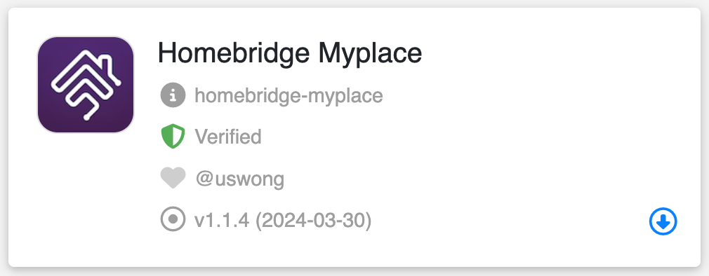

<span align="center">

<p align="center">

</p>

# homebridge-myplace

[](https://github.com/homebridge/homebridge/wiki/Verified-Plugins)
[](https://www.npmjs.com/package/homebridge-myplace)
[](https://www.npmjs.com/package/homebridge-myplace)
[](https://github.com/uswong/homebridge-myplace/blob/master/LICENSE)
[](https://discord.gg/uaEXgtt72q)


</span>

An independent plugin bringing [Advantage Air](https://www.advantageair.com.au/) MyPlace System, its smaller siblings (E-zone, MyAir, MyAir4, etc) and its cousins (e.g. Fujitsu AnywAir) to Homekit.

## Supported Advantage Air Control Units
  * [MyPlace](https://apps.apple.com/au/app/myplace/id996398299)
  * [MyAir4](https://apps.apple.com/au/app/myair4/id925994861)
  * [MyAir](https://apps.apple.com/au/app/myair/id481563583)
  * [E-zone](https://apps.apple.com/au/app/e-zone/id925994857)
  * [Fujitsu anywAIR](https://apps.apple.com/au/app/anywair/id1509639853)

## Installation
1. Install Homebridge via these instructions for [Raspbian](https://github.com/homebridge/homebridge/wiki/Install-Homebridge-on-Raspbian), [HOOBS](https://support.hoobs.org/docs) or [macOS](https://github.com/homebridge/homebridge/wiki/Install-Homebridge-on-macOS), if you have not already.

2. Make sure that <B>jq</B> and <B>curl</B> are installed.  Try to install <B>jq-1.7</B> if you can.  It is much faster.

3. Find the `homebridge-myplace` plugin via the Homebridge UI 'Plugins' tab search function, once found, click the blue *down-arrow* at the bottom right to install.  
  
     <p align="left">
     
     </p>

     Once installed, `Config: homebridge-myplace` UI will pop up, then follow the steps outlined in Step 4 below.

     

     If for some reasons, the `Config: homebridge-myplace` UI did not pop up, locate your newly installed `Homebridge Myplace` plugin and click on the three dots at the bottom right and select `Plugin Config` to get to the `Homebridge MyPlace` UI.
   
5. Configuring MyPlace plugin:
   
   In <B>Device Settings</B> area, fill out the `Name`, `IP Address` and `PORT used` fields (default PORT is `2025` for most users, Fujitsu anywAIR users set this to `10211` ) and check/uncheck the self-explanatory checkboxes for `Include extra timers` and `Enable detailed debug log for this device`, click `SAVE` then `RESTART`.

   For advanced users, you could check the `Enable detailed debug log for this plugin` under <B>Global Plugin Settings</B> if you want to see the detailed log of the plugin to diagnose any issue with the plugin.
     
   For users who do not have access to Homebridge UI have to make sure that a config, as shown in the example below, is in the homebridge config.json:
   
   ```
   {
    "name": "MyPlace",
    "debug": false,
    "devices": [
        {
            "name": "Aircon",
            "ipAddress": "192.168.50.117",
            "port": 2025,
            "extraTimers": true,
            "debug": false
        }
    ],
    "platform": "MyPlace"
   }
   ```

## How it Looks and Works
### (A) Aircon System (MyAir, E-zone, etc) has the following typical Homekit tiles:
<p align="left">

</p>

#### (i) Thermostat, Fan Switch and Fan Speed Control
<p align="left">

 
</p>

<B>Thermostat</B> is where the desired target temperature can be set.  

<B>Thermostat</B> has 4 modes- <B>Off</B>, <B>Cool</B>, <B>Heat</B> and <B>Auto</B>. It does not have <B>dry</B> and <B>fan</B> modes.  As such, the <B>Thermostat Auto</B> mode is repurposed as <B>dry</B> mode in this plugin and a separate <B>Fan</B> switch is used for <B>fan</B> mode.

Both the <B>Thermostat</B> and <B>Fan</B> switch has associated fan speed control and either one can be used to set the fan speed. It is duplicated only for convenience. The fan speed control has 4 tiers - <B>low</B>, <B>mid</B>, <B>high</B> and <B>auto</B> or <B>ezfan</B> and the %-rotationSpeed is snapped to 25% for <B>low</B>, 50% for <B>mid</B>, 90% for <B>high</B> and 100% for <B>auto</B> or <B>ezfan</B>.

#### (ii) Timer
<p align="left">

</p>

A timer is repurposed from <B>Lightbulb</B> accessory and its <B>%-brightness</B> as proxy for timer duration, configured to represent 6 minutes per 1%. So a 10%-timer is a 60-minutes or 1-hour timer and 25%-timer is a 2.5-hours timer. A maximum of 10-hour timer (100%-timer) can be set. This timer will turn ON or OFF the Aircon system.

If <B>Include extra timers</B> was selected during the setup process, 3 more timers would have been created- a <B>Fan Timer</B>, a <B>Cool Timer</B> and a <B>Heat Timer</B>:
<p align="left">

</p>

These timers will turn ON the Aircon system in specific mode as their names suggest. 

*Please note that the icons on the Timer tiles in the example above have been deliberately changed to distinguish them from lights.*

#### (iii) Zone Control
<p align="left">

</p>

Zone control is repurposed from <B>Fan</B> accessory with its <B>%-rotationSpeed</B> as proxy for Zone damper %-open and <B>rotationDirection</B> as <B>myZone</B> button.  <B>Thermostat</B> accessory is used for setting the Zone target temperature.

There are three possible Zone Control configurations depending on the setup of your Aircon system:

<B>(a) A non temperature controlled Zone:</B> If your system has no temperature sensors, then there will only be a simple <B>Fan</B> accessory for your Zone Control.  The Fan slider is for adjusting the desired damper %-open manually.

<B>(b) A temperature controlled Zone but without myZone defined:</B> If your system has temperature sensors but <B>myZone</B> is not defined, then there will be a simple <B>Fan</B> accessory and a <B>Thermostat</B> accessory.           

The Fan slider here is to show the damper %-open for this zone for your INFO only. It is set automatically by the system, it cannot be adjusted manually. To turn off the Zone, slide the slider to zero. To turn it on, tap anywhere within the slider.

The <B>Thermostat</B> is for setting the target temperature for this zone by moving the big white dot. The small white dot is an indicating of the measured temperature of the Zone for your INFO. The mode on this <B>Thermostat</B> is also just for your INFO only. It will show `Cool` or `Heat` when the Aircon mode is `Cool` or `Heat` respectively. It will show `Auto` when the state of the Aircon is `Off` or the mode is `vent` or `dry`. You cannot change the state or the mode of the Aircon here.

<B>(c) A temperature controlled Zone with myZone defined:</B> If your system has temperature sensors and <B>myZone</B> is defined, then there will be a round button for setting this zone as <B>myZone</B> in addition to a simple <B>Fan</B> accessory and a <B>Thermostat</B> accessory as detailed in <B>(b)</B> above.

Please note that <B>myZone</B> cannot be turned `Off` as per AdvantageAir system design. It can only be turned `Off` by setting another zone as <B>myZone</B>.  However, if a Zone, which is set as <B>myZone</B>, is turned off by sliding the Fan slider to zero, this plugin will automatically set another open Zone to be <B>myZone</B> with preference to an open Constant Zone. If there is no other open Zone, then this plugin will open a Zone with preference to a Constant Zone and set it as <B>myZone</B>.

### (B) Lights
<p align="left">

</p>

<p align="left">


</p>

Light with dimmer has a slider to control its brightness while a light without dimmer just has a simple ON/OFF light switch.

### (C) Fans

<p align="left">

</p>

<p align="left">

</p>

From version 1.1.6 onwards, if a light switch has a name ending with " Fan", it is regarded as a switch for turning ON or OFF a fan.  The icon on Homekit will then be a fan instead of a lightbulb. 

### (D) Garage Door and Blinds
<p align="left">

</p>

<p align="left">


</p>

Garage Door is either Opened or Closed, hence it appears as a simple switch while Blinds can be partially open, as such, it has a slider to set the %-open.

## How You Can Help
* Report Bugs/Errors by opening Issues/Tickets.
* Suggest Improvements and Features you would like to see!
* If you are loving this plugin or using this plugin, please feel free to give me a `Star`!


## Special Thanks

This project would not have been possible without the work of others in the Homebridge community.

1. Many thanks to [Mitch Williams](https://github.com/mitch7391) who has created the wonderful [homebridge-cmd4-AdvantageAir](https://github.com/mitch7391/homebridge-cmd4-AdvantageAir) plugin and has allowed me to participate in its development and in the process I have leant a lot about GitHub and on **bash** and **javascript** coding in homebridge environment.
2. Many thanks also to [John Talbot](https://github.com/ztalbot2000) for his fantastic [homebridge-cmd4](https://github.com/ztalbot2000/homebridge-cmd4) plugin which I forked and reused most of the original logic, with some modifications and adjustments to meet the requirements of this plugin.
3. And never forget to thank my beautiful wife who has put up with my obsession on this.....


## LICENSE
This plugin is distributed under the MIT license. See [LICENSE](https://github.com/uswong/homebridge-myplace/blob/main/LICENSE) for details.
